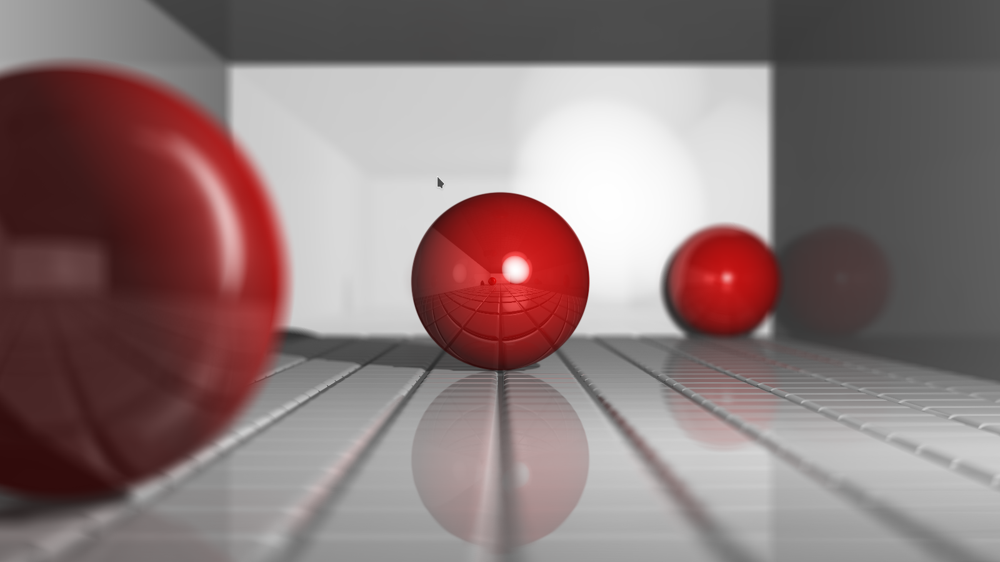

# RayTracer

A basic ray tracer implemented in C/C++ with SDL as a graphical backend



## Building/Dependencies:

This project relies on SDL for displaying the rendered result.  If you have apt, you can install the libsdl2-dev package. It also uses the C++ thread library which might require extra flags with some compilers.  On Ubuntu, this generally works:

```
g++ RayTracer.cpp -lpthread -lSDL2 -o RayTracer
```

## Changing the rendered scene:

Currently the scene data is compiled into the executable; I hope to change this soon so that it is stored in a seperate configuration file.

For now, you can change this in `RayTracer.cpp` in the section denoted by the comments `// START TEST SCENE OBJECT`

### Object Types:

The following three object types are built in:

- #### Plane:
    ```
    Plane_SceneObjectData Object = { {{a, b, c}, d}, reflection, {r, g, b} };
    ```
    - `a, b, c, d` define the mathematical plane `ax + by + cz = d`
    - `reflection` is the fraction of light intensity reflected off the surface (from [0,1])
    - `r,g,b` are the RGB components of its color (these are floats where `{0.0, 0.0, 0.0}` is black and `{1.0, 1.0, 1.0}` is white )

    To make the object render in the scene, you must add `&Object` to the declaration of `objectsData` and `plane_SceneObject` to the corresponding indice in the declation of `objectsType`

- #### Sphere:
    ```
    Sphere_SceneObjectData Object = { {{x, y, z}, r}, reflection, {r, g, b} };
    ```
    - `x, y, z` is the center of the sphere
    - `r` is the radius of the sphere
    - `reflection` is the fraction of light intensity reflected off the surface (from [0,1])
    - `r,g,b` are the RGB components of its color (these are floats where `{0.0, 0.0, 0.0}` is black and `{1.0, 1.0, 1.0}` is white )

    To make the object render in the scene, you must add `&Object` to the declaration of `objectsData` and `sphere_SceneObject` to the corresponding indice in the declation of `objectsType`

- #### Tiled Floor:
    ```
    TileFloor_SceneObjectData Object = { {{a, b, c}, d}, reflection, {r, g, b} };
    ```
    - `a, b, c, d` define the mathematical plane `ax + by + cz = d`; the current implementation requires the floor to be horizontal and aligned with the 3D axes, so `a` and `b` must be set to zero
    - `reflection` is the fraction of light intensity reflected off the surface (from [0,1])
    - `r,g,b` are the RGB components of its color (these are floats where `{0.0, 0.0, 0.0}` is black and `{1.0, 1.0, 1.0}` is white )

    To make the object render in the scene, you must add `&Object` to the declaration of `objectsData` and `tiledFloor_SceneObject` to the corresponding indice in the declation of `objectsType`

## Creating your own object types:

To add your own object types, you must define functions for the geometrical intersection of rays and that object and put them together in a `Scene_ObjectType` structure. This structure requires the following information:

- `name`: a human readable string for the object type
- `getIntersect`: a function that finds the geometrical intersection between `ray` and `objectData`; if an intersection is found, it returns the intersection in `*returnPoint` and the normal vector to the object at that point in `*normalVector` and returns `true`; if no intersection is found, it returns `false`
- `getIntersectNoSelf`: implements the same functionality as `getIntersect`, except `ray -> point` is a point that is known to be on that object, and the function must exclude that point as a possible intersection
- `getColor`: returns the color of the `objectData` at the point `point` in `*returnColor` and the portion of light reflected in `*returnReflection`

See the files in the `SceneObjects` folder for the implementations of built in types
